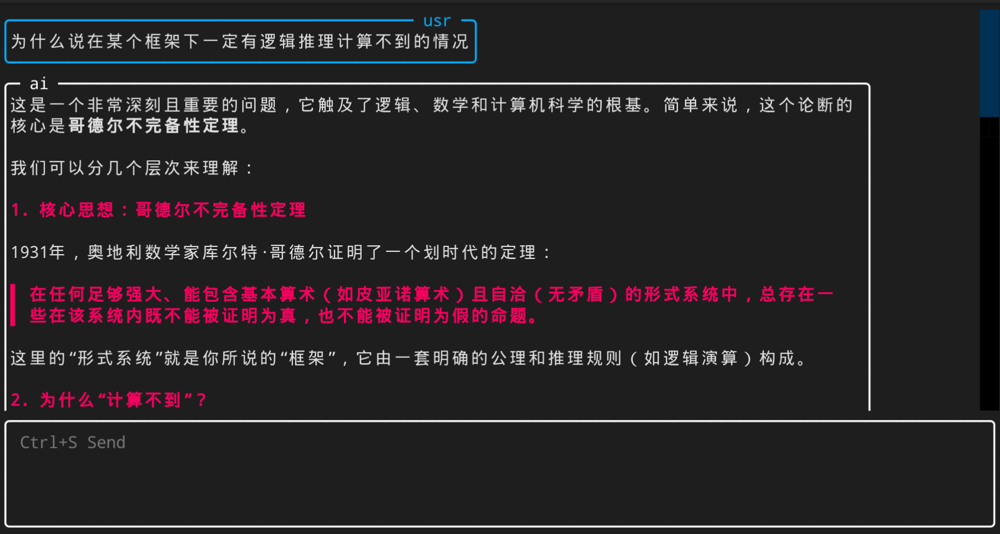

# DS Assistant CLI (CN)



一个 Linux 平台下在终端调用 Deepseek API 的脚本, 主要让 DS 承担 AI 学术助手的工作. 目前正在使用`Textual`库重写代码, 新版本的功能更加简洁, 外观更加人性化.

## 待办
1. 文本框选
2. 复制粘贴快捷键
3. 接入字典

## 开始

### 环境需求
要求 Python3 安装以下库:
```
openai
textual
rich
```

### 安装

1. 克隆此仓库: `git clone https://github.com/PupilEarthquake/DS_Assistant_CLI.git`
2. 进入此文件夹: `cd /Path/to/DS_Assistant_CLI`
3. 在 `ds.py` 首行添加你的 Python 路径, 比如 `#!/home/pupilearthquake/anaconda3/envs/AI/bin/python`
4. 添加可执行权限: `chmod +x ds.py`
5. 创建符号链接: `sudo ln -s /path/to/your/ds.py /usr/local/bin/ds`, 注意`/path/to/your/ds.py`必须是绝对路径


### 配置文件

1. 在 `user.conf` 中填入你的 API key


## 使用方法


1. `ds -h`: 显示帮助
2. `ds ce`: 中译英
    - `ds ce -t` 使用推理模型. 默认使用快速模型
    - `ds ce -m` 要求 DS 对一个中文句子给出3种翻译
    - `ds ce -h` 显示帮助, __其他模块同理__
3. `ds ec`: 英译中
    - `ds ec -s` 要求 DS 分析句式结构
5. `ds dict`: 词典, 默认接入有道辞典(未实现)
6. `ds chat`: 一般聊天
7. 聊天记录可见和`ds.py`同目录的 `chathist`文件夹 , 若不需要历史记录可以手动删除


# DS Assistant CLI (EN)

This is a script for calling the Deepseek API in the terminal on the Linux platform, primarily designed for DS to serve as an AI academic assistant. Currently, the code is being rewritten using the `Textual` library, making the new version more streamlined in functionality and more user-friendly in appearance.

## Getting Started

### Requirements
Python3 with the following libraries installed:
```
openai
textual
rich
```

### Installation

1. Clone this repository: `git clone https://github.com/PupilEarthquake/DS_Assistant_CLI.git`
2. Navigate to the folder: `cd /Path/to/DS_Assistant_CLI`
3. Add your Python path at the first line of `ds.py`, for example: `#!/home/pupilearthquake/anaconda3/envs/AI/bin/python`
4. Add executable permissions: `chmod +x ds.py`
5. Create a symbolic link: `sudo ln -s /path/to/your/ds.py /usr/local/bin/ds`. Note that `/path/to/your/ds.py` must be an absolute path.

### Configuration

1. Enter your API key in `user.conf`.

## Usage

1. `ds -h`: Show help.
2. `ds ce`: Chinese-to-English translation.
   - `ds ce -t` Use the reasoning model. The fast model is used by default.
   - `ds ce -m` Request DS to provide three translations for a Chinese sentence.
   - `ds ce -h` Show help. Similarly for other modules.
3. `ds ec`: English-to-Chinese translation.
   - `ds ec -s` Request DS to analyze sentence structure.
5. `ds dict`: Dictionary, default integration with Youdao Dictionary (not yet implemented).
6. `ds chat`: General chat.
7. Chat history can be found in the `chathist` folder in the same directory as `ds.py`. If history is not needed, you can delete it manually. 

